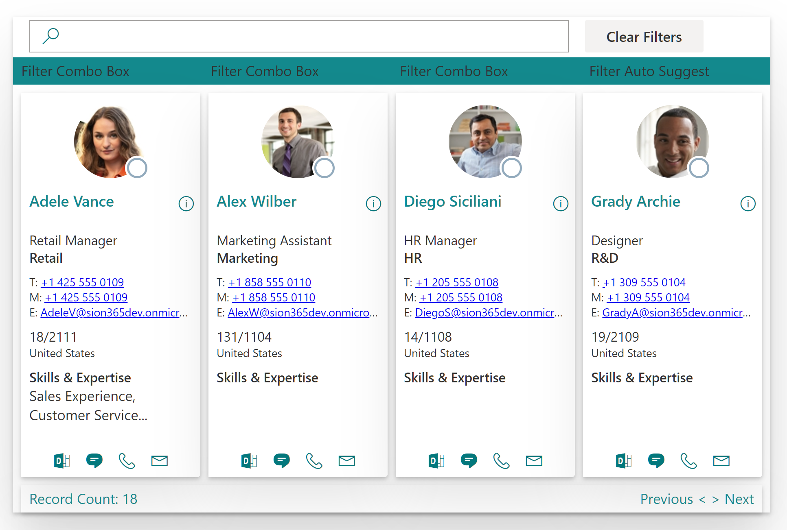

# SPFx-People-Search

SPFx People Search webpart built with React Hooks and Microsoft Graph

## Summary

This project has been created as an exploration of React Hooks and accompanies a series of blog posts:

- [SharePoint/SPFx: Returning to Webpart Development Part #1](https://www.sjlewis.com/2020/09/08/sharepoint-spfx-returning-to-webpart-development-part-1/)

- [SharePoint/SPFx: Returning to Webpart Development Part #2](https://www.sjlewis.com/2020/09/09/sharepoint-spfx-returning-to-webpart-development-part-2/)

- [SharePoint/SPFx: Returning to Webpart Development Part #3 \(with React Hooks\)](https://www.sjlewis.com/2020/09/27/sharepoint-spfx-returning-to-webpart-development-part-3-with-react-hooks/)

- [SharePoint/SPFx: Returning to Webpart Development Part #4 (with React Hooks)](https://www.sjlewis.com/2020/12/02/sharepoint-spfx-returning-to-webpart-development-part-4-with-react-hooks/)



## Used SharePoint Framework Version


## Applies To

- [SharePoint Framework](https://aka.ms/spfx)
- [Microsoft 365 tenant](https://docs.microsoft.com/en-us/sharepoint/dev/spfx/set-up-your-developer-tenant)

> Get your own free development tenant by subscribing to [Microsoft 365 developer program](http://aka.ms/o365devprogram)

## Prerequisites

> TO-DO: Add special pre-requisites...

## Solution

Solution|Author(s)
--------|---------
SPFx-People-Search | Author details (Siôn J. Lewis, [www.sjlewis.com](https://www.sjlewis.com))

## Version history

Version|Date|Comments
-------|----|--------
1.0.0.3|29 November 2020|Added search by display name and total record count
1.0.0.2|29 November 2020|Initial release

## Disclaimer

**THIS CODE IS PROVIDED *AS IS* WITHOUT WARRANTY OF ANY KIND, EITHER EXPRESS OR IMPLIED, INCLUDING ANY IMPLIED WARRANTIES OF FITNESS FOR A PARTICULAR PURPOSE, MERCHANTABILITY, OR NON-INFRINGEMENT.**

---

## Minimal Path to Awesome

- Clone this repository
- Ensure that you are at the solution folder
- Open VSCode\'s Terminal **\[Ctrl\]+\[`\]** and run the following commands:

```Node
npm install
gulp trust-dev-cert
gulp clean
gulp build
gulp serve --nobrowser
```

### Debugging Tips

Open the **[launch.json](/.vscode/launch.json)** file and edit the two entries and replace 'tenant' with your tenant's name:

- "Tenant Workbench"
- "Tenant Test Page"

Run the following commands in VSCode\'s Terminal **\[Ctrl\]+\[`\]** to "Serve" the code to, for example, the local Workbench.

```Node
gulp serve --nobrowser
```

And one of your new profiles and **'Start Debugging'**...

> TIP: Press **\[Ctrl\]+\[c\]** to stop the "gulp serve" process.

### Deployment Package

Run the following commands in VSCode\'s Terminal **\[Ctrl\]+\[`\]** in preparation to deploying to an App Catalogue:

```Node
gulp clean
gulp build
gulp bundle --ship
gulp package-solution --ship
```

---

## Features

TO-DO: Description of the extension that expands upon high-level summary above.

This extension illustrates the following concepts:

- topic 1
- topic 2
- topic 3

> Notice that better pictures and documentation will increase the sample usage and the value you are providing for others. Thanks for your submissions advance.
> TO-DO: Share the web part with others through Microsoft 365 Patterns and Practices program to get visibility and exposure. More details on the community, open-source projects and other activities from http://aka.ms/m365pnp.

---

## References

- [Getting started with SharePoint Framework](https://docs.microsoft.com/en-us/sharepoint/dev/spfx/set-up-your-developer-tenant)
- [Building for Microsoft teams](https://docs.microsoft.com/en-us/sharepoint/dev/spfx/build-for-teams-overview)
- [Use Microsoft Graph in your solution](https://docs.microsoft.com/en-us/sharepoint/dev/spfx/web-parts/get-started/using-microsoft-graph-apis)
- [Publish SharePoint Framework applications to the Marketplace](https://docs.microsoft.com/en-us/sharepoint/dev/spfx/publish-to-marketplace-overview)
- [Microsoft 365 Patterns and Practices](https://aka.ms/m365pnp) - Guidance, tooling, samples and open-source controls for your Microsoft 365 development
